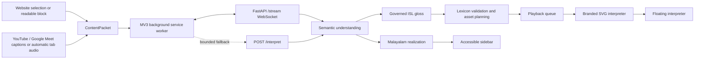

# SignVerse AI

SignVerse AI is an accessibility-focused Chrome extension and FastAPI service that interprets
website reading context, YouTube captions or automatic tab-audio transcription, and Google Meet
live captions into structured Malayalam and Indian Sign Language (ISL) output.

> **Release status:** The local YouTube accessibility flow is production-hardened and covered by
> automated unit and integration tests. A public release remains gated on native-ISL review,
> Deaf-community comprehension testing, privacy review, and signed distribution. No third-party
> sign recordings or derived animation clips are distributed in this repository.

## Architecture



The content script never contacts the API directly. Backend traffic is owned by the Manifest V3
background service worker, which maintains the streaming connection and validates messages.

## Features

- Manifest V3 Chrome extension built with React, TypeScript, Vite, and Tailwind CSS.
- Cursor- and selection-aware website reading context instead of whole-page extraction.
- Automatic YouTube startup with official-caption priority and tab-audio transcription fallback.
- Synchronized floating English captions and ISL avatar playback.
- Minimize, restore, close, drag, and resize controls on the floating interpreter.
- Production UI hides mock-provider and playback-debug controls.
- Google Meet live-caption extraction with speaker-aware updates.
- Persistent WebSocket streaming with ordered delivery and bounded REST fallback.
- Semantic-first interpretation using either deterministic mock output or OpenAI Responses API.
- Natural Malayalam output kept separate from governed ISL gloss generation.
- Governed lexicon, explicit unsupported-token handling, playback planning, and renderer contracts.
- Branded, draggable, resizable SVG interpreter with persisted geometry and avatar preference.
- Keyboard navigation, ARIA live feedback, high-contrast support, and reduced-motion behavior.

## Interface previews

The public repository includes the original SignVerse interpreter artwork used by the renderer.
Runtime screenshots will be added after the native-ISL and privacy review gate.

<p align="center">
  
</p>

<!-- Demo GIF placeholder: docs/images/signverse-website-demo.gif -->
<!-- Demo GIF placeholder: docs/images/signverse-youtube-demo.gif -->
<!-- Demo GIF placeholder: docs/images/signverse-meet-demo.gif -->

## Requirements

- Chrome or Chromium with Manifest V3 extension support
- Node.js 22 or newer and npm
- Python 3.12 or newer
- An OpenAI API key only when using the OpenAI or tab-audio transcription paths

## Installation

### 1. Clone and install

```bash
git clone https://github.com/adhentom/SignVerse.git
cd SignVerse
npm ci

cd apps/api
python3.12 -m venv .venv
source .venv/bin/activate
python -m pip install --upgrade pip
python -m pip install -e '.[dev]'
cd ../..
```

### 2. Configure the backend

```bash
cp apps/api/.env.example apps/api/.env
```

The mock interpretation provider is the safe default. To use OpenAI, edit the ignored `.env`:

```text
SIGNVERSE_INTERPRETATION_PROVIDER=openai
OPENAI_API_KEY=<your-local-key>
```

### 3. Configure and build the extension

```bash
cp apps/chrome-extension/.env.example apps/chrome-extension/.env.local
npm run check
```

Set `VITE_SIGNVERSE_BACKEND_URL` to the backend origin before building. Vite uses it to generate
the minimum required Chrome host permission.

### 4. Load the extension

1. Open `chrome://extensions`.
2. Enable **Developer mode**.
3. Choose **Load unpacked**.
4. Select `apps/chrome-extension/dist`.
5. Copy the extension ID into `SIGNVERSE_CORS_ORIGINS` in `apps/api/.env`.
6. Start the API and reload the extension.

## Usage

Start the backend from `apps/api`:

```bash
source .venv/bin/activate
uvicorn signverse_api.main:app --reload
```

Open a YouTube watch page after starting the backend. SignVerse starts automatically and gives
official YouTube captions priority. If no cues arrive within the configured timeout, the extension
captures tab audio and streams short segments to the backend transcription endpoint. The floating
caption and interpreter appear without a popup action; if official captions later become available,
audio capture stops and duplicate packets are rejected. Tab-audio transcription requires a
configured backend transcription provider.

On ordinary websites, SignVerse opens automatically and interprets the first readable viewport
context; selecting text or moving to another readable paragraph updates that context. Google Meet
starts its live-caption session automatically. The extension popup is status-only and is not
required to start any supported pipeline.

Useful endpoints:

- `GET /health`
- `POST /interpret`
- `WS /stream`
- `POST /transcribe` when transcription is configured
- `/docs` in development when API documentation is enabled

## Development

```bash
# Extension
npm run lint
npm run typecheck
npm test
npm run build
# Or run the complete extension gate:
npm run check

# Backend
cd apps/api
ruff check .
ruff format --check .
mypy
pytest

# Dataset and animation tooling
cd ../..
PYTHONPATH=scripts python -m pytest tools/tests
```

## Project structure

```text
apps/
  api/                    FastAPI interpretation and streaming service
  chrome-extension/       Manifest V3 extension, adapters, widget, and renderer
assets/avatar/            Original SignVerse artwork and vector rig assets
assets/signs/             Project-authored placeholders and local registry boundary
config/                   Permission-gated dataset source configuration
docs/                     Architecture, accessibility, API, governance, and evaluation docs
scripts/                  Dataset import and video-to-landmark conversion tools
tools/                    Optional animation-pipeline dependencies and tests
benchmarks/               Interpretation-quality benchmark definitions
```

## Sign datasets and media

Third-party dictionary media, signer recordings, and landmark-derived animation clips are not
distributed. A download URL is not a redistribution license. Authorized users can place datasets
under ignored local import directories and run the configuration-driven tools after recording
permission, provenance, attribution, and native ISL review.

See [Licensing and access](docs/datasets/LICENSING_AND_ACCESS.md),
[Import pipeline](docs/datasets/IMPORT_PIPELINE.md), and
[Third-party notices](THIRD_PARTY_NOTICES.md).

## Roadmap

- Complete native ISL review and Deaf-community comprehension testing.
- Publish only explicitly redistributable, reviewer-approved sign assets.
- Expand regional and phrase-level lexicon coverage with versioned provenance.
- Expand the cross-version browser-fixture matrix for YouTube and Google Meet.
- Harden authenticated, rate-limited production deployment and observability.
- Package signed Chrome Web Store releases after privacy and accessibility review.

## Acknowledgements

- Indian Sign Language Research and Training Centre (ISLRTC) for public ISL resources and
  ecosystem leadership; no ISLRTC media is redistributed here.
- OpenAI Responses and transcription APIs for the optional hosted AI provider.
- FastAPI, React, Vite, Tailwind CSS, MediaPipe, Three.js, and other open-source dependencies.
- Deaf and hard-of-hearing reviewers whose participation is required before production claims.

## Contributing and security

Read [CONTRIBUTING.md](CONTRIBUTING.md), [CODE_OF_CONDUCT.md](CODE_OF_CONDUCT.md), and
[SECURITY.md](SECURITY.md) before opening a contribution or security report.

## License

Project code and original SignVerse artwork are licensed under the [MIT License](LICENSE).
Third-party datasets and derived artifacts are excluded unless their own compatible terms and
provenance are documented.
